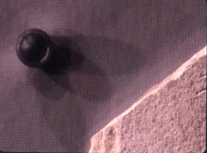
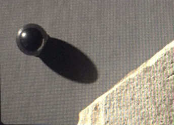

# PTM_run_on_iphone
Project of CSE_260 (Speed Up PTM Computation for Mobile Devices)

- [My work](#my-work)

- [Data comparison](#data-comparison)

- [How to run it](#how-to-run-it)

- [Demo picture](#demo-picture)

- [Reference](#reference)

## Introduce

RTIScan is an app for archaeologists. It can use 36 pictures to simulate light and shadow changes from different angles.

## My work

- Fixed the bug that the color is not normal

  

- Compress the time of matrix operations (The comparative data is in the table below) 

  

## Data comparison

#### pic size: 2000*1334

|                                    | Before optimization | After optimization |
| ---------------------------------- | ------------------- | ------------------ |
| Reading images to momery           | 3698.06ms           | 3245.52ms          |
| Initial Process(Memory allocation) | 183.62ms            | 502.11ms           |
| Convert int Matrix to double       | 5788.28ms           | 3255.85ms          |
| SVD calculation                    | 0.38ms              | 0.364065ms         |
| Large matrix multipulation         | **241551.93ms**     | **105.31ms**       |
| Total time                         | 251222.42ms         | 7109.27ms          |

#### pic size: 889*684

|                                    | Before optimization | After optimization |
| ---------------------------------- | ------------------- | ------------------ |
| Reading images to momery           | 446.03ms            | 144.59ms           |
| Initial Process(Memory allocation) | 42.90ms             | 86.68ms            |
| Convert int Matrix to double       | 1194.90ms           | 566.31ms           |
| SVD calculation                    | 0.33ms              | 0.334ms            |
| Large matrix multipulation         | **55432.48ms**      | **21.14ms**        |
| Total time                         | 57116.82ms          | 1081.02ms          |

#### pic size: 342*243

|                                    | Before optimization | After optimization |
| ---------------------------------- | ------------------- | ------------------ |
| Reading images to momery           | 161.47ms            | 144.59ms           |
| Initial Process(Memory allocation) | 6.94ms              | 12.94ms            |
| Convert int Matrix to double       | 167.85ms            | 86.81ms            |
| SVD calculation                    | 0.30ms              | 0.29ms             |
| Large matrix multipulation         | **7601.55ms**       | **2.89ms**         |
| Total time                         | 7938.30ms           | 247.61ms           |

## How to run it

1. Install app RTIScan(iphone6 test runs without problems)
2. Prepare 36 photos with different angles
3. Put the photo in the iphone
4. Run the app
5. Import pictures from phone album
6. Adjust the black shadow to coincide with the physical ball in the photo
7. Touch Locate Light，
8. Touch Process, Waiting for the program to process the picture
9. Touch render, Enter the rendering interface
10. You can simulate the movement of the light source by moving your finger on the screen.

## Demo picture

screenRecording：

36 pictures‘s size: 889*684

720p version demo  in [youtube](https://youtu.be/jtG5FovvEls)

## Reference

paper：

T. Malzbender, D. Gelb and H. Wolters, "**Polynomial Texture Maps**", *Proc. ACM SIGGRAPH*, pp. 519-528, 2001.

Code:

before optimization：[PTM_Scan_iOS](https://github.com/LenaShengzhen/PTM_Scan_iOS)

